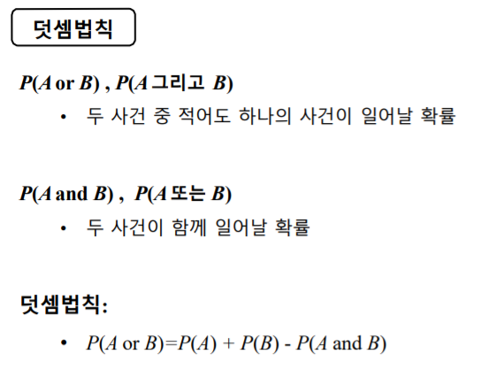

# 확률

불확실성이 있는 세계 → 확률적인 성격을 가지고 있다

# 확률의 의미와 덧셈법칙

**도수이론**

- 확률은 한 시행을 동일한 조건 하에서 독립적으로 반복할 때 그 사건이 일어날 것으로 예측되는 횟수의 전체 시행횟수에 대한 백분률이다

**주관적 견해**

- 사건에 대한 주관적인 확신의 정도가 확률이다. 이는 반복시행 여부와 관계없이 정의된다
- 믿음의 정도

**조합의 숫자 ≠ 전체 경우의 수**

**벤다이어그램과 배반**

- 밴다이어그램 : 직사각형과 그 안에 든 원을 이용해서 사건들을 표현하고, 사건과 사건 간의 관계를 묘사하기 위한 하나의 그래픽 도구
- sample space : 사각형, S
- A, B : 각각의 이벤트
- 조인트 이벤트, 인터섹션, 공통부분, 교집합
- 여사건 :  anything but A, A를 제외한 다른 어느것들, 원 A의 바깥부분

**덧셈법칙**

한 사건이 발생할 때 다른 사건이 함께 발생ㅎㄹ 수 없는 경우 두 사건은 상호배반 또는 배반 관계에 있다고 한다.

# 조건부 확률, 곱셈법칙, 독립

**조건부확률**

- 변수 y에 관심이 있지만, 분리 지표 x를 거기에 꼬리표로 달아줬다.
    - 꼬리표로 사용된 그것이 정보, 조건이다
- P(A| B)
- 사건 B가 주어진 조건 하에서 사건 A가 일어날 확률

**주변확률 (비조건부 확률)**

- 주변에 있는 숫자들을 이용해 답할 수 있을 때
- 답하는 데 아무런 정보도 이용하지 않았을 때
- P(A), P(B)

- 정보는 주어졌을 때 포커스하는 역할을 한다
- 2*2 테이블을 이용해서 주변확률, 조건부 확률, 결합 확률에 대해 확인할 수 있다

**곱셈법칙(결합확률)**

- 두 사건이 모두 일어날 확률은 '하나의 사건이 일어날 확률'과 '하나의 사건이 일어났다는 조건 하에서 다른 하나의 사건이 일어날 조건부확률'을 곱하려 얻는다
- P(A and B) = P(A)·P(B|A) = P(B) ·P(A|B)

**독립**

- 하나의 사건이 일어나느냐 마느냐와 상관없이 다른 사건이 일어날 확률이 변하지 않으면, 두 사건의 관계가 **독립(independent)**이라고 한다. 그렇지 않은 경우 두 사건의 관계가 **종속(dependent)**이라고 한다.
- 두 사건이 서로 독립일 때, 두 사건이 모두 일어날 확률은 각각의 비조건부 확률을 곱하여 얻는다. 이를 좁은 의미의 곱셈법칙이라고 부른다.
    - 두 사건 A와 B가 독립이면, P (A and B) = P(A)P(B)