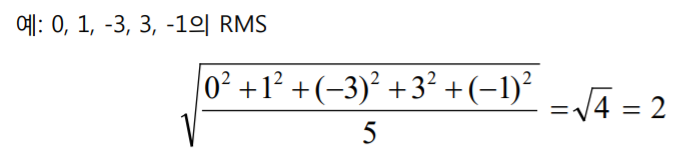
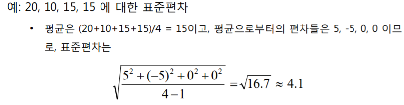

# Week2-1

# 평균과 중앙값

**평균**

- 관측치의 총합을 관측치의 개수로 나누어 구함
- 평균이 중요하지만 전부는 아님, 평균은 같지만 파진 정도가 다를 수 있음

**중앙값**

- 중간에 있는 순서의 값

**최빈치**

- 가장 빈번하게 발생하는 값

### **중앙값**

절반 이상의 숫자들이 이 값보다 크거나 같고, 동시에 절반 이상의 숫자들이 이 값보다 작거나 같은 수
히스토그램은 중앙값에서 그 면적이 양분됨
중앙값은 n 이 홀수이면 (n+1)/2번째로 크거나 작은 숫자임
중앙값은 n이 짝수이면 n/2번째 숫자와 (n+1)/2번째 숫자의 평균으로 정의
Median Voter Theorem

- 중앙값이 LAD의 해로 얻어진다는 것과 수학적으로 같은 내용임. 선호의 비대칭분포 이용하여 후보자의 location choice 문제 설명
- 정치인은 정책을 정할 때 사람들이 선호하는 값의 중앙값을 사용한다
- 중앙값을 가져갈 수록 유권자를 얻음 (유권자들에게 가까이 가는 전략)

### **평균과 중앙값의 관계**

평균은 극단적인 값에 영향을 더 받고, 중앙값은 덜 받는다

히스토그램이 좌우대칭이면 평균값과 중앙값이 같다

히스토그램이 한 쪽으로 치우쳐 있으면 평균보다는 중앙값이 나을 수 있다

# 표준편차와 자유도의 직관적 의미

### 제곱근-평균-제곱(RMS)

계산은 표현의 역순(제곱 후 평균, 최종적으로 제곱근)

### 표준편차(Sy, SDy)

표준편차(SD)는 “평균으로부터의 편차들”의 RMS와 “대략” 비슷

**자유도**

- 주어진 조건 하에서 자유롭게 변할 수 있는 값
- 자유도는 합쳐진 값들 중에서 실질적으로 독립인 값들의 개수
- 자유도를 감안해서 자유로운 것 하나를 제외한 n-1값을 적용
- 표준편차 계산하는 경우의 자유도는 ”자료의 개수 - 1”

- 0/0 = it can be anything, 위험에 대해서는 할 말이 없다
    - 정답을 얻으려면 자유도를 적용해야 한다